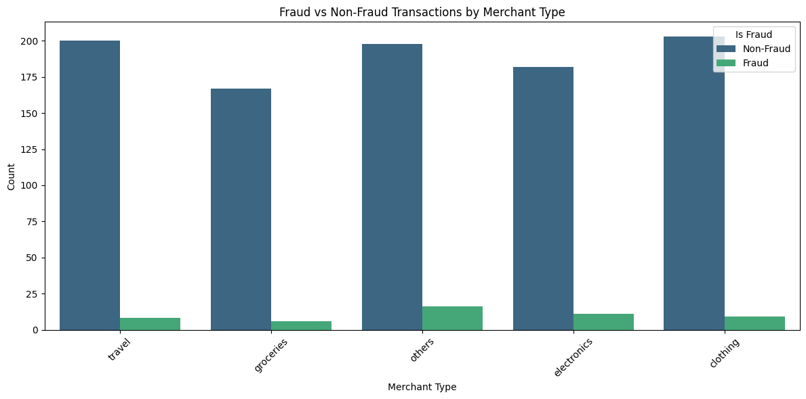

# Fraud Detection Visualization

## Overview
This project analyzes transaction data to explore how fraud cases are distributed across different merchant types. A grouped countplot is used to highlight differences between fraud and non-fraud transactions across various categories.

## Objective
- Visualize fraud patterns across merchant types.
- Identify where fraudulent activity is more common to inform potential fraud prevention strategies.

## Tools Used
- Python (Google Colab)
- pandas
- seaborn
- matplotlib

## Key Findings
- **Transaction Balance:** Across all merchant types, non-fraudulent transactions significantly outnumber fraudulent ones, reflecting the typical imbalance seen in fraud detection datasets.
- **Merchant Types:** The "others" category showed the highest number of fraudulent transactions compared to other merchant types.
- **Fraud Spread:** Fraud was present across all merchant types (travel, groceries, electronics, clothing), but consistently at lower counts relative to non-fraud.
- **Insight:** Fraud prevention efforts may benefit from closer monitoring of broad categories like "others," where fraud attempts may be harder to detect through traditional category-based filters.

## Visualization

### Fraud vs Non-Fraud Transactions by Merchant Type

---

## Files
- `fraud_detection_visual.ipynb` — Full notebook including data loading, visualization, and analysis.
- `Fraud.png` — Grouped countplot showing fraud vs non-fraud transactions across merchant types.

## How to Run
1. Install required Python libraries: `pandas`, `matplotlib`, `seaborn`, `openpyxl`.
2. Open the notebook in Google Colab or Jupyter Notebook.
3. Run all cells sequentially to reproduce the analysis and visualization.
